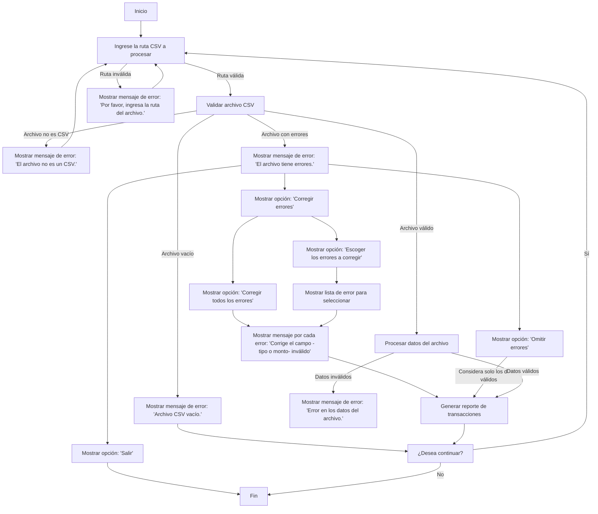

# README

## Introducción

Este proyecto es un reto técnico desarrollado en TypeScript. Su propósito es demostrar habilidades en el lenguaje TypeScript mediante la implementación de una solución funcional y eficiente para el reto técnico planteado.

## Instrucciones de Ejecución

### 1. Instalación de Dependencias

Asegúrate de tener un editor como Visual Studio Code o similares instalado en tu sistema.

### 2. Ejecución de la Aplicación

1. Clona este repositorio:
   ```bash
   git clone https://github.com/iamsandro/retotecnico-cobol.git
   cd retotecnico-cobol
   ```
2. Instala las dependencias:
   ```bash
   npm install
   ```
3. Ejecuta el programa:
   ```bash
   npm start
   ```

## Enfoque y Solución

La solución implementada sigue un enfoque modular, distribuyendo las responsabilidades en diferentes secciones del código. Se priorizó la creación de código limpio, acompañado de comentarios explicativos en las partes más relevantes.

## Estructura del Proyecto

La estructura del proyecto está organizada de la siguiente manera:

- `src/`: Contiene la lógica principal del programa.
- `dist/`: Carpeta para los archivos generados necesarios para la ejecución.
- `docs/`: Documentación adicional sobre el proyecto.
- `tests/`: Scripts de prueba para validar la funcionalidad del programa.

### Árbol de Archivos

```plaintext
└── 📁src
    ├── 📁__tests__
    │   ├── 📁__mocks__
    │   │   ├── empty.csv
    │   │   ├── emptyFile.csv
    │   │   ├── testData.csv
    │   │   ├── testInvalidAmount.csv
    │   │   ├── testInvalidAmountNegative.csv
    │   │   ├── testInvalidID.csv
    │   │   └── testInvalidType.csv
    │   ├── cli.test.ts
    │   ├── parcerCSV.test.ts
    │   ├── reportGenerator.test.ts
    │   └── transactionDataAnalyzer.test.ts
    ├── 📁constants
    │   └── messages.ts
    ├── cli.ts
    ├── index.ts
    ├── parcerCSV.ts
    ├── reportGenerator.ts
    ├── transactionDataAnalyzer.ts
    └── types.ts
```

### 4. Diagrama de flujo



### 4. Uso

Al ejecutar el programa, se mostrarán una serie de prompts en la terminal que guiarán al usuario en el uso de la aplicación. A continuación, se describen los prompts y cómo responder a ellos:

1. **Ingrese la ruta CSV a procesar:**

   - El programa pedirá que ingreses la ruta del archivo CSV que deseas analizar. Ejemplo:
     ```plaintext
     Por favor, sube la ruta del archivo (Ejemplo: ./data/transactions.csv):
     ```
   - Respuesta esperada: El nombre del archivo, como `./transactions_abril_2023.csv`.

2. **Se le mostrará el reporte de transaciones:**

   - Se te pedirá que elijas el tipo de reporte que deseas generar. Ejemplo:
     ```plaintext
           Reporte de Transacciones:
           -------------------------
           Balance Final: 325
           Transacción de Mayor Monto: ID 3 - 200)
           Conteo de Transacciones por Tipo: Crédito: 3 Débito: 2
     ```
   - Respuesta esperada: El número correspondiente a la opción deseada, como `1` o `2`.

3. **Confirmación de salida:**

   - Una vez generado el reporte, el programa le preguntará si desea continuar. Ejemplo:
     ```plaintext
           ¿Quieres continuar? (Y/n):
     ```
   - Respuesta esperada: `y` para procesar otro archivo o `n` para finalizar, si ingresa cualquier caracter diferente de `n` el programa considerará que desea continuar.

4. **Si no ingresa una ruta al archivo csv**
   - Si no ingresa ninguna ruta se le mostrará un mensaje de error:
     ```plaintext
           > Por favor, sube la ruta del archivo.
     ```
5. **Si ingresa una ruta con una extensión diferente a .csv**
   - Si ingresa una ruta de un archivo que no es csv se le mostrará un mensaje de error:
     ```plaintext
           > El archivo no es un CSV.
     ```
6. **Si ingresa una ruta de un archivo CSV vacío**
   - Si ingresa una ruta de un archivo que no es csv se le mostrará un mensaje de error:
     ```plaintext
           > Error 😖: Archivo CSV vacío. Por favor, verifica el archivo.
     ```
7. **Si ingresa un archivo con un registro erroneo**
   - Si se encuentra un error en uno de los registros el programa se detiene y se le mostrará un mensaje de error:
     ```plaintext
           > Error 😖: Tipo de transacción inválido en la fila 5: Cérdito.
     ```

Estas interacciones aseguran que el usuario pueda navegar fácilmente por las funcionalidades del programa.
