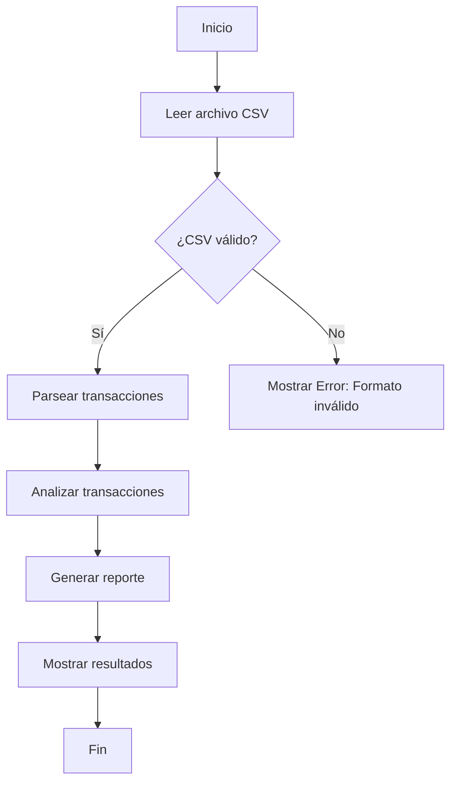
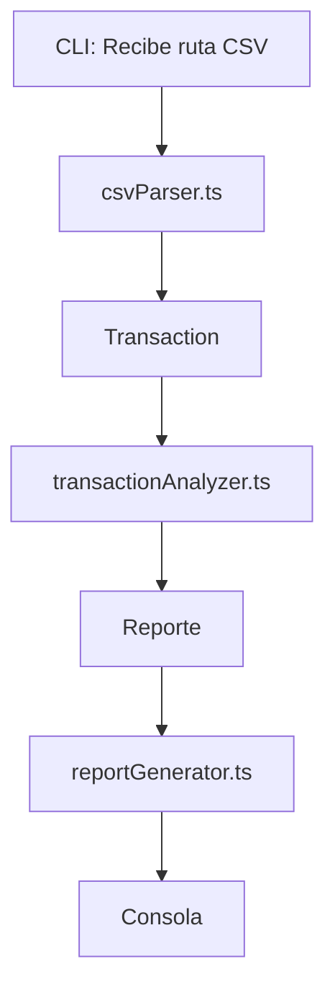
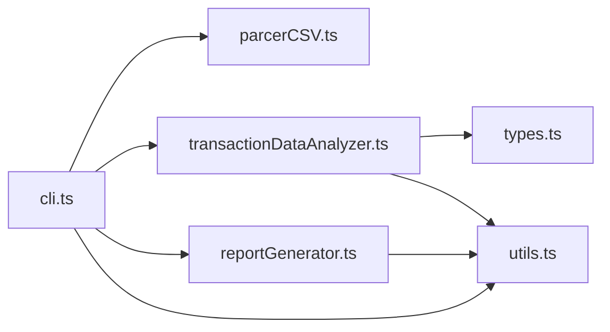

**DIAGRAMA DE FLUJO DEL PROYECTO**

```mermaid
flowchart TD
    A[Inicio] --> B[Leer archivo CSV]
    B --> C{¿CSV válido?}
    C -->|Sí| D[Parsear transacciones]
    C -->|No| E[Mostrar Error: Formato inválido]
    D --> F[Analizar transacciones]
    F --> G[Generar reporte]
    G --> H[Mostrar resultados]
    H --> I[Fin]
```

 

**FLUJO COMPLETO DEL PROYECTO**

```mermaid
flowchart TB
    A[CLI: Recibe ruta CSV] --> B[csvParser.ts]
    B --> C[Transaction]
    C --> D[transactionAnalyzer.ts]
    D --> E[Reporte]
    E --> F[reportGenerator.ts]
    F --> G[Consola]
```

**DIAGRAMA DE RELACIÓN ENTRE COMPONENTES**

```mermaid
graph LR
    CLI[cli.ts] --> Parser[parcerCSV.ts]
    CLI --> Analyzer[transactionDataAnalyzer.ts]
    CLI --> Report[reportGenerator.ts]
    Analyzer --> Types[types.ts]
    CLI --> Utils[utils.ts]
    Analyzer --> Utils[utils.ts]
    Report --> Utils[utils.ts]
```

 
